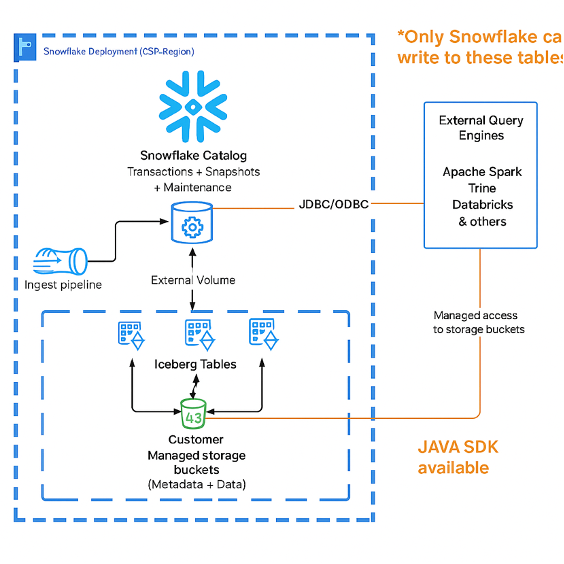
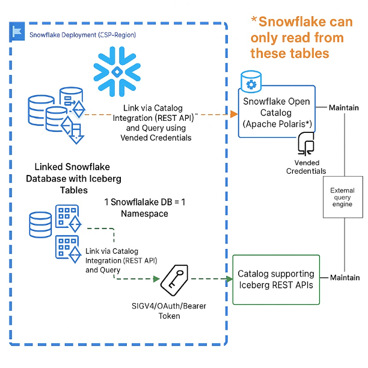
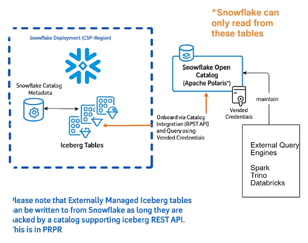
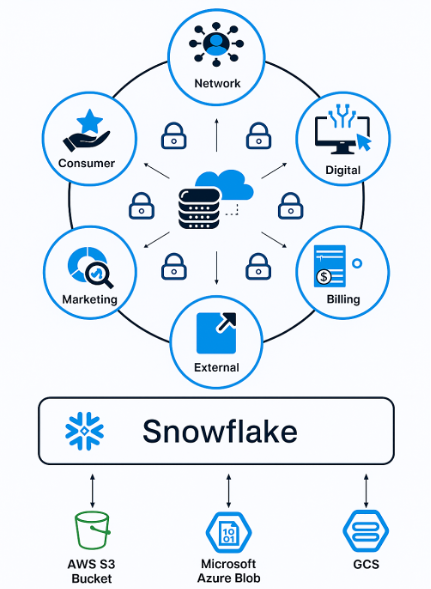
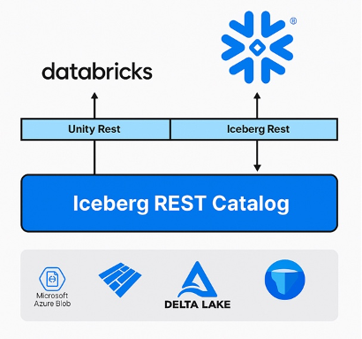
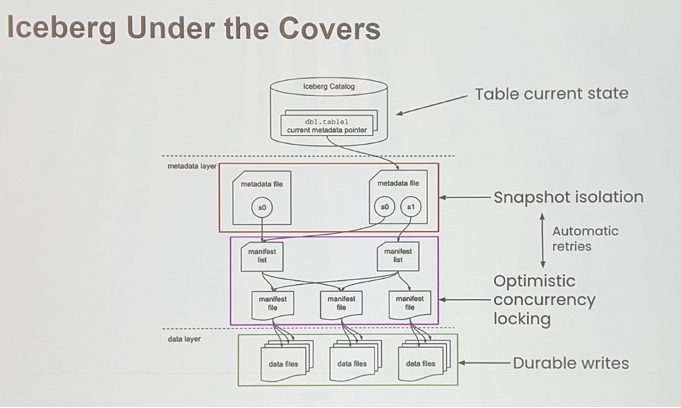
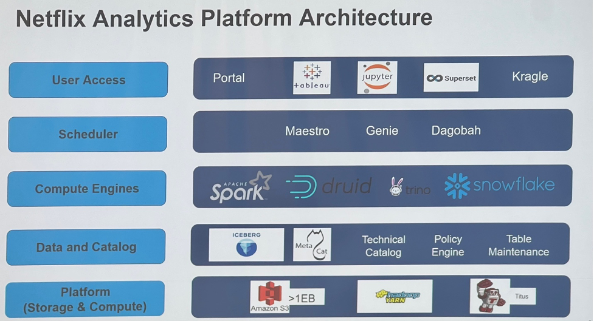
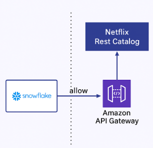
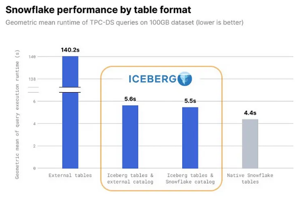
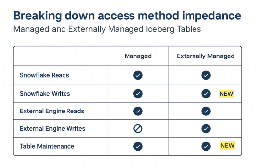

# Apache Iceberg X Snowflake Summit 25

At this year’s Snowflake Summit, my primary focus was on all things Apache Iceberg. I attended multiple sessions led by Snowflake, Netflix, Capital One, Qlik, T-Mobile and others diving deep into how Iceberg is rapidly becoming the default standard for modern analytics. In this article, I’m sharing key takeaways from each session — highlighting how these companies are using Iceberg to enable better data interoperability, improve governance and scale data engineering across different environments.

## Session 1: Connect Teams with Iceberg tables using Snowflake

Snowflake offers two primary methods for working with Apache Iceberg tables:

- **Snowflake-Managed Iceberg Tables**: In this model, Snowflake manages both the data in your storage buckets and the Iceberg catalog. This provides a tightly integrated experience.
- **Externally-Managed Iceberg Tables**: This approach allows teams to bring their existing Iceberg tables and catalogs (such as AWS Glue or a REST catalog) to Snowflake. Snowflake can then query the data that is managed externally.

### Sharing Iceberg Tables as Governed Data Products

A core theme of the presentation was moving beyond simply providing raw table access. Instead, the focus is on creating and sharing curated Data Products.

**Key features of sharing via Data Products:**

- **Unified Content**: A single Data Product can contain a mix of Iceberg tables and standard native Snowflake tables.
- **Robust Governance**: All data is fully governed using Snowflake's native security features, including Secure Views and Row Access Policies.
- **Cross-Cloud Auto-Fulfillment**: Data Products can be shared seamlessly across different cloud providers and regions.

**Few limitations that were mentioned:**

- Change Data Capture (CHANGE_TRACKING) cannot be enabled on the provider side for externally managed Iceberg tables, limiting some real-time use cases.
- External query engines cannot directly access a shared Data Product. Direct access requires the consumer to have a Snowflake account.

### Interoperability with Snowflake Open Catalog

The presentation also focused on enabling interoperability between Snowflake and other query engines (like Apache Spark, Trino, and Databricks) using Snowflake Open Catalog. This catalog, based on the Apache Polaris project acts as a central, neutral service for managing metadata and access to Iceberg tables.

### 1. Read access to Snowflake-Managed Iceberg Tables

#### Method 1: Direct Access via Snowflake Catalog and Storage Buckets

- **Mechanism**: External engines connect directly to the Snowflake Catalog using JDBC/ODBC to get the table's metadata and transaction history.
- **Data Access**: You provide the external engine with direct access to the underlying storage buckets by managing IAM policies.
- **Key Limitation**: This method bypasses Snowflake's governance model. Access control is cumbersome because it must be managed separately for every external engine at the storage layer (IAM).
  

#### Method 2: Access via Snowflake Open Catalog (Apache Polaris)

This was the newer, more centralized approach so discussed.

- **Mechanism**: Metadata from the Snowflake Catalog is synchronized with the Snowflake Open Catalog.
- **Data Access**: External engines query the Open Catalog, which provides them with vended (temporary) credentials to access the storage buckets.
- **Key Advantage**: This provides centralized access management. You can manage RBAC policies for all external engines in one place (the Open Catalog) instead of handling individual IAM permissions.

### 2. Read access to Externally-Managed Iceberg Tables

It allows Snowflake to query Iceberg tables that are managed by external systems.

- **How it works**: A data provider creates Iceberg tables using their engine of choice and syncs the metadata to the Open Catalog. The consumer can then onboard these tables into Snowflake using the Iceberg REST API or, more seamlessly, create a catalog-linked database. This linked database allows querying the external tables directly from Snowflake without a complex onboarding process.
- **Key Limitation**: Snowflake can only read from these tables.

### Key Points to build a Data Product

- If the consumer is not on Snowflake, you must provision a Reader Account.
- If the consumer is on Snowflake, you can share a Data Product directly to their account.
- Dynamic Tables are recommended if data aggregation is helpful for the consumer. This allows you to pre-process the data and deliver more valuable insights.
- The final product can be secured with Secure Views and Row Access Policies and shared via Cross-Cloud Auto-Fulfillment.

### Key Points for interoperability between engines

- **If the table is Snowflake-Managed**:
  - For multiple consumers needing centralized access management, you should use the Snowflake Open Catalog.
  - Otherwise, you can manage access policies directly on the storage bucket and have the consumer's engine connect to the Snowflake Catalog and storage.
  
- **If the table is Externally-Managed**:
  - If the consumer's current catalog supports the Iceberg REST API, they can access the tables directly via Catalog Integration.
  - If not, you can use Snowflake Open Catalog to provide access to Snowflake.
  - The end goal is to onboard the external tables into Snowflake or use a catalog-linked database for querying.

## Session 2: Maximizing Connected data at T-Mobile with Iceberg

T-Mobile has undertaken a significant data transformation, moving from a siloed and inefficient legacy system to a modern, unified data architecture. T-Mobile transitioned to a "Connected Data Intelligence" model with Snowflake as the central data hub. This approach connects all data domains and underlying cloud storage, creating a single source of truth. This move was designed to increase agility, optimize costs by eliminating data duplication, and foster collaboration to solve business problems more effectively.

### Architecture for Interoperability

T-Mobile has implemented an Iceberg REST Catalog that allows both Snowflake and Databricks (via its Unity Catalog) to interact with the same data stored in open format on Microsoft Azure Data Lake Storage (ADLS). This architecture ensures that data remains in a central location while being accessible to different platforms, effectively federating access without data movement.

### Why Iceberg?

- **Open Standard**: It avoids vendor lock-in.
- **Key Features**: Provides transactional guarantees (ACID compliance), schema evolution, and time travel capabilities, which are crucial for reliable analytics and AI.
- **Flexibility & Governance**: T-Mobile's strategy leverages the "best of both worlds"—the flexibility of querying open Iceberg tables directly, combined with the robust governance and security features offered by Snowflake.

### The presentation highlights two primary use cases demonstrating the power of this new architecture:

#### 1. Near Real-Time Telemetry

- **Challenge**: Modernize legacy Hadoop pipelines to provide faster insights.
- **Solution**: Over 90 PB of network logs are managed on-premise in Hadoop and aggregated using Spark. This processed data, amounting to over 10 TB daily, is pushed directly to Snowflake as Iceberg Tables. In the cloud, their Snowflake environment stores over 6 PB of this data, serving thousands of internal users.
- **Outcomes**:
  - Faster data access and near real-time insights.
  - Elimination of redundant data storage.
  - Significant cost savings through a hybrid approach.

#### 2. Cross-Team Data Sharing

- **Challenge**: Enable secure, real-time data sharing to improve network performance based on customer feedback.
- **Solution**: This initiative allows for secure and seamless sharing of live network data across different teams using Snowflake.
- **Outcomes**:
  - Enabled the creation of "customer-first" products through cross-functional collaboration.
  - Eliminated redundant data copies.
  - Provided near real-time analytical insights to enhance network performance.

## Session 3: Optimize Iceberg tables for Peak Query Performance in Qlik Open Lakehouse

Qlik Open Lakehouse is a fully managed capability within Qlik Talend Cloud that makes it easy, effortless, and cost-effective for users to ingest, process, and optimize large amounts of data in Apache Iceberg-based lakehouse.

### Their presentation highlights main challenges with Iceberg:

- **For real time data, frequent writes = small files**  
  Lots of small files = overhead in file operations

- **Frequent writes = lots of snapshots**  
  Large metadata files, expensive to scan

- **Frequent updates = lots of unneeded files**  
  Storage bloat

### This section covers Qlik optimization spec for Iceberg:

#### File Compaction

- **Goal**: To improve query performance by rewriting many small data files into fewer, larger ones. This reduces the overhead of opening and closing files. For Merge-on-Read (MOR) tables, compaction also removes delete files.
- **Process**: Compaction is resource-intensive and creates a new table snapshot. Users must decide what and when to compact, typically targeting file sizes between 128MB and 512MB. The presentation mentions two strategies: Binpack and Sort.
- **Example Command**:  
  `CALL system.rewrite_data_files(table => 'examples.nyc_taxi_yellow')`

#### Snapshot Expiration

- **Problem**: Every write or compaction operation generates a new snapshot, which consists of metadata files. While snapshots enable time-travel queries, they accumulate over time and consume storage space.
- **Solution**: Expire old snapshots to clean up metadata. This is controlled by parameters that define the maximum age of a snapshot and the minimum number of snapshots to retain.
- **Example Command**:  
  `CALL system.expire_snapshots(table => 'examples.nyc_taxi_yellow')`

#### Orphaned File Cleanup

- **Problem**: Failed or canceled operations (like a failed compaction) can leave behind "orphaned" data files that are not referenced by any snapshot. These files remain in storage, costing money and creating clutter.
- **Solution**: Run a cleanup process to identify and remove any file not associated with a retained snapshot. This action can be dangerous, so dry run options are available.
- **Example Command**:  
  `CALL remove_orphan_files(table => 'examples.nyc_taxi_yellow')`

#### The Qlik Adaptive Iceberg Optimizer

Qlik's solution automates the manual maintenance tasks described above.

- **Continuous & Adaptive Compaction**: It automatically compacts data as it's ingested, prioritizing compactions based on the highest benefit and available compute capacity. It can perform both BINPACK and SORT compactions and will re-compact data over time as needed.
- **Automated Cleanup**: The optimizer aggressively manages snapshot expiration and orphaned file cleanup. It also frequently rewrites metadata to reduce file sizes.
- **"Set it and Forget it"**: The tool uses automatically scaling compute clusters, which users can configure to balance latency and cost, removing the need for manual intervention.

## Session 4: Secure Exabyte Scale Lakehouse Analytics at Netflix with Iceberg and Snowflake

Netflix utilizes Snowflake’s highly scalable and performant platform to seamlessly connect to its Iceberg REST catalog and run advanced analytics. Netflix is leveraging Snowflake’s latest capabilities—including Iceberg REST catalog integration with auto-refresh, vended credentials, and multi-bucket support—to optimize workloads at unprecedented scale.

Netflix maintains its exabyte scale data in 100% iceberg based datawarehouse. Prior to the full adoption of Iceberg with an Iceberg Rest Catalog (IRC), Netflix's data architecture faced several significant pain points:

- **Multiple Sources of Truth**: Data and metadata were scattered, leading to inconsistencies.
- **Data Staleness**: Data ingested into analytics platforms like Snowflake was often stale because it had to be copied, and not all data could be moved daily.
- **Operational Overhead**: The architecture required significant manual effort to manage access, refresh metadata, and synchronize permissions (ACLs).
- **Lack of Flexibility**: It was difficult to "Bring Your Own Engine" (BYOE), and thick clients created migration challenges.

### The Solution: A Centralized Iceberg Rest Catalog

To solve these issues, Netflix implemented an Iceberg Rest Catalog (IRC), which serves as the single source of truth for all data and metadata. This new architecture provides several key benefits:

- **Unified Data Ownership**: Netflix retains ownership of its data and metadata, enhancing security and governance.
- **Fresh, Direct Access**: Query engines like Snowflake, Spark, and Trino can directly access the latest data in the warehouse through the IRC, eliminating staleness.
- **Bring Your Own Engine (BYOE)**: Any query engine that can communicate with the REST catalog can be used, offering greater flexibility.
- **Simplified Architecture**: The IRC streamlines the entire platform, utilizing lightweight clients and allowing for transparent upgrades.

### Key Integration Points

- **Externally Managed Iceberg Tables**: An initial approach allowed Snowflake to mirror metadata from Netflix's Iceberg tables. However, this still led to some data staleness and operational complexity.
- **Direct IRC Integration**: The primary solution involves Snowflake directly connecting to Netflix's IRC via an AWS API Gateway. This allows Snowflake to discover and refresh tables from the catalog in real time.
  
  
  
- **Querying as Local Tables**: With the "Snowflake Catalog Linked Database" feature, users can query the Netflix Iceberg tables as if they were native Snowflake tables, providing a seamless experience.
- **Multi-Region Data Support**: The collaboration enables a single Iceberg table to be composed of data from multiple S3 buckets across different AWS regions. Netflix's IRC provides the table locations, and Snowflake's engine can query them all.

### The integration also incorporates robust security and access control:

- **Access Control Lists (ACLs)**: User and group permissions are synced from the warehouse to Snowflake, ensuring that access policies are consistently enforced.
- **Fine-Grained Access Control (FGAC)**: To manage sensitive data, Netflix applies row-level and column-level security policies on views created over the unmanaged Iceberg tables.

## Session 5: How Capital One Uses Iceberg to Optimize Loading and Storage Costs

Historically, Capital One operated two distinct data storage systems:
1. A Data Warehouse (Snowflake) for structured data, consumed by Product Owners and Analysts.
2. A Data Lake for unstructured, semi-structured, and structured data, consumed by Data Scientists and Engineers using tools like Spark.

### This dual-storage approach created several critical challenges:

- **Duplicate Costs**: Maintaining two systems meant paying twice for storage, load compute, and data management.
- **Data Disparity**: Writing to two separate platforms created a high risk of discrepancies due to ingestion failures, inconsistent data remediation, and different data retention policies.
- **Lack of Tool Flexibility**: Users were siloed. Analysts were largely confined to Snowflake, while data scientists were limited to data lake tools, preventing them from using their preferred compute engine on all data.

### The Solution: A Unified Lakehouse Architecture with Iceberg

To address these issues, Capital One adopted a Lakehouse strategy, rallying around a target state where all analytics tools consume a single copy of data directly from the data lake. The setup has evolved into a multi-catalog, multi-format strategy, orchestrated by a central "Business Catalog" that provides a unified abstraction layer over the various underlying technologies (Glue Catalog, Snowflake Catalog, Parquet, Delta Lake, and Iceberg).

### Key Architectural Features

- **Single Source of Truth**: A "Unified Data Stream" ingests all data types (structured, semi-structured, unstructured) into one central data lake.
- **Open Standards**: By using Iceberg, the data remains in an open format (Parquet files) in Capital One's own cloud storage.
- **Flexible Consumption**: Both Snowflake and other tools (like Spark) can now access the exact same data. Business Analysts can query the data lake via Snowflake, while Data Scientists can use Spark on the same tables.

### Significant Cost Savings

In migrating just the first 40 datasets (focused on Cyber Logs and Cloud Observability), Capital One realized:

- ~45% savings on their overall storage footprint.
- 20% reduction in Load Compute costs.

## Session 6: Enabling Data Engineering on Iceberg with Snowflake

Apache Iceberg provides an open storage standard that can democratize your data stored in disparate data lakes by providing freedom and interoperability to use various data processing engines. Here we dive into newly launched features that enhance interoperability as well as bring Snowflake’s ease of use to your Iceberg data lakes.

### Write Directly to Any Iceberg Table (Private Preview)

Snowflake now allows you to fully read from and write to externally managed Iceberg tables, no matter where they are stored. This new capability provides full Data Definition Language (DDL) and Data Manipulation Language (DML) operations, effectively extending Snowflake's powerful data engineering features to your entire Iceberg ecosystem.

This eliminates the "impedance" between managed and external tables, allowing you to:
- Perform writes, updates, deletes, and merges on external Iceberg tables directly from Snowflake.
- Seamlessly transition existing write workloads to any Iceberg REST API-compliant catalog.
- Achieve industry-leading write performance and functional parity with other Iceberg engines like Spark.

### Link Remote Catalogs with Catalog Linked Databases

You can now link a remote Iceberg REST Catalog, including Apache Polaris, directly to Snowflake, creating what is called a **Catalog Linked Database**. This creates a bi-directional connection that centralizes your data and makes external Iceberg tables discoverable and accessible within the Snowflake environment.

**Key benefits include:**
- Automatic discovery of namespaces and tables within your external catalog.
- Simplified data management by activating data from nearly anywhere.

### Automate Table Maintenance and Optimization

When Iceberg tables are linked to Snowflake, you can automate key maintenance tasks using **Polaris Policies** to ensure performance and efficiency.

**Automated optimizations include:**
- Expiring old snapshots  
- Compacting data files  
- Rewriting manifests  
- Deleting orphan files  
- Removing outdated metadata files

### Activate Semi-Structured Data with Variant Shredding

The Apache Iceberg v3 specification introduces support for **VARIANT (semi-structured)** and **Geospatial types**. Snowflake enhances your ability to work with complex data types within your Iceberg ecosystem through a feature called Variant Shredding. This process automatically extracts individual fields from a semi-structured VARIANT column and stores them as distinct, independent columns. This makes querying and analyzing JSON-like data faster and more efficient.

# Other Companies Using Apache Iceberg and Snowflake at the Summit

### PayPal
PayPal modernized its analytics and data infrastructure by consolidating disparate data sources into Snowflake and adopting Apache Iceberg for platform flexibility and future-proofing. Iceberg enabled sharing Snowflake-generated data across multiple clouds without traditional ETL, using Snowflake-managed Iceberg catalogs, replication, and dynamic tables. This centralized back-office analytics, streamlined ETL, and supported near real-time insights and reconciliation. PayPal is also exploring ML for business outcome prediction and generative AI for dynamic network adaptation.

### Goldman Sachs
Goldman Sachs built a secure, enterprise-grade open lakehouse using Apache Iceberg and Snowflake as part of its Legend Lakehouse architecture. Their focus includes governing data lifecycle elements such as storage, access, quality, sharing, and event-driven notifications. Iceberg manages high volumes of structured data with versioning, time-travel, and tool compatibility, while maintaining strict governance and operational standards critical for finance.

### Komodo Health
Komodo Health migrated from Snowflake native tables to Snowflake-managed Apache Iceberg tables to simplify data interoperability and reduce infrastructure complexity. Handling 2M+ queries daily across 1,000+ warehouses, Iceberg helped minimize redundant data copies, improve archival strategies, reduce compute costs, and maintain SOC 2 compliance — supporting scalability and regulatory needs in healthcare.

### Autodesk
Autodesk replaced a legacy Apache Hive data lake with a Snowflake and Iceberg-based solution to simplify data replication and support modern analytics. Adopting Iceberg improved data accessibility, performance, and consistency, enabling advanced BI use cases and streamlined operations. This transition showcases how organizations modernize big data platforms by layering Iceberg atop cloud-native analytics engines.

### Booking.com
Booking.com uses Apache Iceberg alongside PySpark, Snowflake, and S3 to scale data processing across hundreds of terabytes daily. Their in-house PySpark SDK synchronizes catalogs, optimizes S3 reads, and maintains data quality and platform performance. Iceberg manages complexity in large-scale data migration, platform evolution, and operational excellence within Booking.com’s AI Data Cloud strategy.

### Lidl
Lidl revamped its ERP analytics platform using Snowflake and Apache Iceberg to enable near real-time data, flexible pipelines, and cost-effective analytics across 10,000+ stores in 32 countries. Using CDC-based pipelines to create Iceberg tables, they achieved up-to-date insights, scalable schema evolution, and strong data quality controls, while optimizing query costs and performance.

### Toyota Motor Europe
Toyota Motor Europe integrated petabyte-scale Apache Iceberg datasets from AWS into Snowflake, complying with stringent EU regulations. This breaks regional data silos, enables cross-region collaboration, and improves vehicle quality and customer service. Iceberg acts as the core table format, allowing seamless sharing, consistent governance, and efficient access between AWS Glue and Snowflake.

### All Nippon Airways (ANA)
ANA improved performance by 62% by switching from Parquet external tables to Snowflake Managed Iceberg, creating a Single Source of Truth for analytics. They built a custom ETL connector with Snowflake Notebooks in 3 days at minimal cost. Their BlueLake platform supports 40,000 users and integrates Cortex ML with custom dbt materializations to enable company-wide ML capabilities.

### NTT Docomo
NTT Docomo built a telecom-grade data mesh using Snowflake and Apache Iceberg to decouple storage and compute, boosting cost efficiency and performance. Iceberg supports internal governance via Snowflake’s Internal Marketplace, enabling secure, scalable telecom data infrastructure while meeting Japan’s strict privacy and operational standards.

### Affirm
Affirm leverages Apache Iceberg to meet financial-grade requirements like data validation history, time travel, and dataset immutability. By adopting Iceberg’s write-once, read-anywhere model and Snowflake’s Open Catalog, Affirm enforces a single logical dataset copy with tag-based versioning. This simplifies governance and supports operational and analytical financial use cases.

### Colgate
Colgate is building a global data platform with Apache Polaris (incubating) and Apache Iceberg to create scalable, interoperable ecosystems. Their Data Products initiative enables real-time collaboration, operational efficiency, and strategic decision-making via modern metadata-driven architecture. Iceberg underpins compatibility across engines and seamless governance globally.

### Illumina
Illumina modernized its manufacturing data infrastructure using Apache Iceberg and Snowflake to boost data accessibility, enable real-time analytics, and improve operational efficiency in genomics. Leveraging Iceberg reduced pipeline latency and built a future-ready platform supporting dynamic workloads with enterprise-grade governance.

